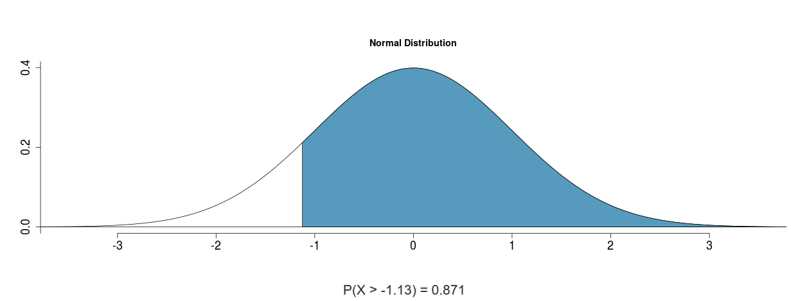
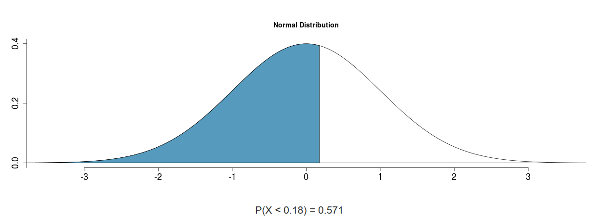
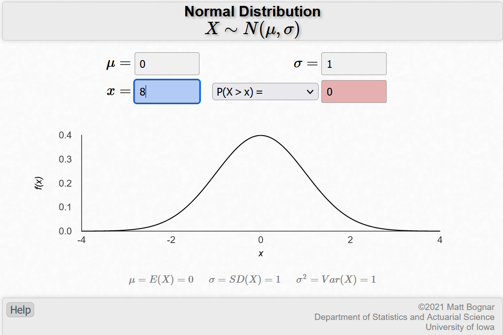
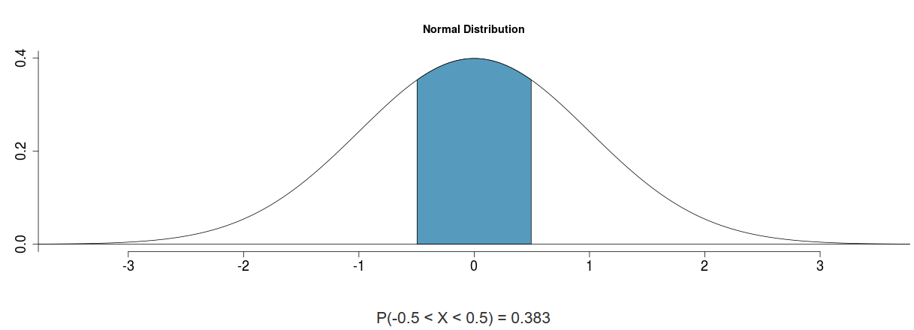
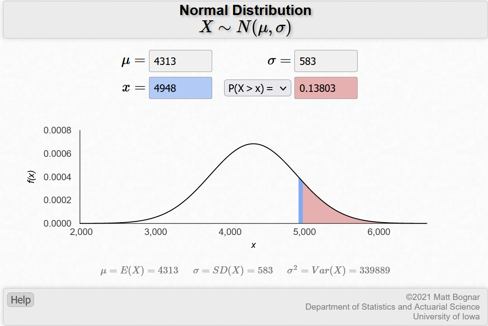
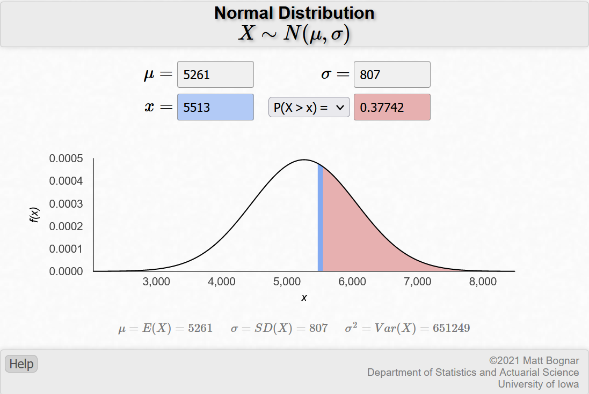
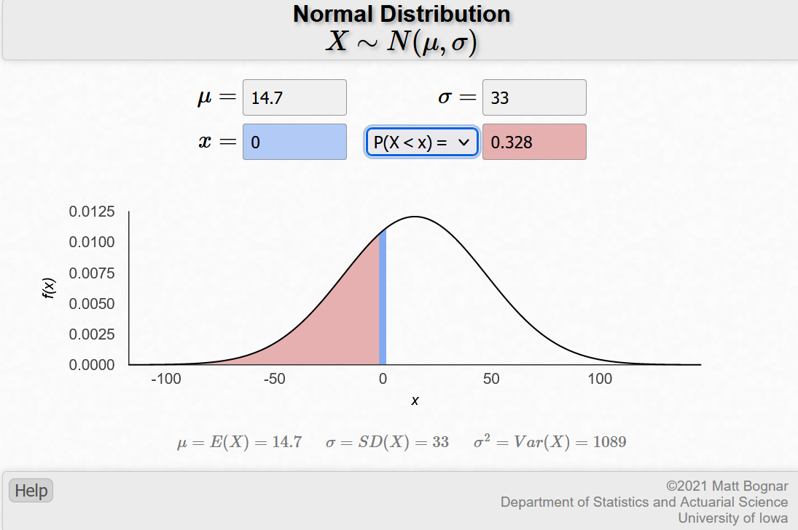
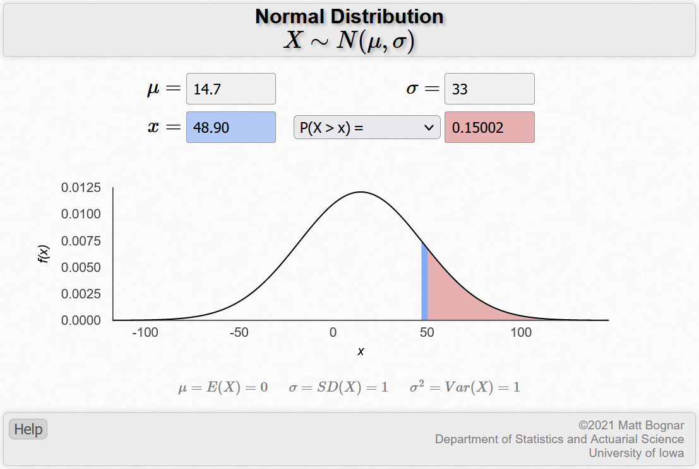

## 4.2Area under the curve, Part II. What percent of a standard normal distribution N(mean = 0; sd = 1) is found in each region? Be sure to draw a graph.

## (a) Z > -1.13 
 {#id .class width=50% height=50%}
```{r}
library(scales)
a <- 1 - pnorm(-1.13,0,1)
percent(a, accuracy=0.01) #Answer
```


## (b) Z < 0.18
 {#id .class width=50% height=50%}
```{r}
b <- pnorm(0.18,0,1)
percent(b,accuracy=0.01) #Answer
```

## (c) Z > 8
 {#id .class width=50% height=50%}
```{r}
c <- 1 - pnorm(8,0,1)
percent(c, accuracy=0.01) #Answer
```
I used a different website as the one covered in class only went up to Z=4. https://homepage.divms.uiowa.edu/~mbognar/applets/normal.html

## (d) absolute(Z) < 0.5
 {#id .class width=50% height=50%}
```{r}
x <- pnorm(0.5,0,1) #percentile for z<0.5
y <- 1-x
z <- pnorm(-0.5,0,1) # percentile for abs
q <- 1-y-z #1 minus each of the tail values gets the value in the middle, or 
#-0.5<Z<0.5
percent(q, accuracy=0.01) #Answer
```
## 4.4 Triathlon times, Part I: In triathlons, it is common for racers to be placed into age and gender groups. Friends Leo and Mary both completed the Hermosa Beach Triathlon, where Leo competed in the Men, Ages 30 - 34 group while Mary competed in the Women, Ages 25 - 29 group. Leo completed the race in 1:22:28 (4948 seconds), while Mary completed the race in 1:31:53 (5513 seconds). Obviously Leo finished faster, but they are curious about how they did within their respective groups. Can you help them? Here is some information on the performance of their groups:
## • The finishing times of the Men, Ages 30 - 34 group has a mean of 4313 seconds with a standard deviation of 583 seconds.
## • The finishing times of the Women, Ages 25 - 29 group has a mean of 5261 seconds with a standard deviation of 807 seconds.
## • The distributions of finishing times for both groups are approximately Normal.

## (a) Write down the short-hand for these two normal distributions.'
Men: N(µ=4313s,sd=583s)
Women: N(µ=5261s,sd=807s)

## (b) What are the Z-scores for Leo's and Mary's finishing times? What do these Z-scores tell you?
```{r}
(4948-4313)/583 #Leo Z-score
(5513-5261)/807 #Mary Z-score
##These scores tell me that Leo finished about 1.08 standard deviations above 
#the mean, and Mary finished about 0.31 standard deviations above the mean.
```
## (c) Did Leo or Mary rank better in their respective groups? Explain your reasoning.
Mary finished better in her respective group. As scores increase in standard deviation above the mean, this means the runner finished slower than the average runner in the respective group. Because Mary had a lower Z-Score, she finished closer to the mean than Leo did, and therefore had a better rank respective to her group.

## (d) What percent of the triathletes did Leo finish faster than in his group?
 {#id .class width=50% height=50%}
```{r}
d<-1-pnorm(4948,4313,583)
percent(d, accuracy=0.01)
```
## (e) What percent of the triathletes did Mary finish faster than in her group?
 {#id .class width=50% height=50%}
```{r}
e<-1 - pnorm(5513,5261,807)
percent(e, accuracy=0.01)
```
## (f) If the distributions of finishing times are not nearly normal, would your answers to parts (b) - (e) change? Explain your reasoning.
Yes, if the distributions of finishing times are not nearly normal, then the mean and standard deviation for the groups would have been impacted positively or negatively. Because of this, Mary and Leo may have finished closer to, or further away from the mean. In other words, there Z-scores may have indicated more or less standard deviations away from the mean. If this was the case, either of them could have finished better or worse relative to the percent of other triathletes, and therefore would have also ranked better or worse in their respective groups. 


## 4.8 CAPM: The Capital Asset Pricing Model (CAPM) is a financial model that assumes returns on a portfolio are normally distributed. Suppose a portfolio has an average annual return of 14.7% (i.e. an average gain of 14.7%) with a standard deviation of 33%. A return of 0% means the value of the portfolio doesn't change, a negative return means that the portfolio loses money, and a positive return means that the portfolio gains money.

## (a) What percent of years does this portfolio lose money, i.e. have a return less than 0%?
 {#id .class width=50% height=50%}
```{r}
percent(pnorm(0,14.7,33),accuracy=0.01)
```
## (b) What is the cutoff for the highest 15% of annual returns with this portfolio?

```{r}
f<-qnorm(.85)
(f*33)+14.7
##The cutoff is 48.90 percent growth
```
 {#id .class width=50% height=50%}


