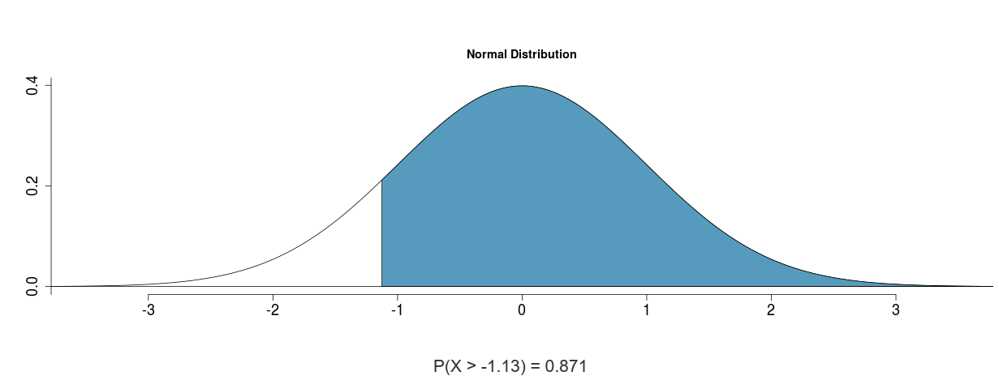
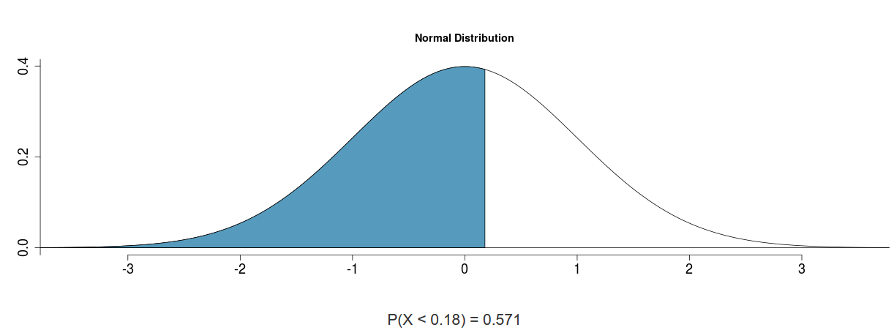
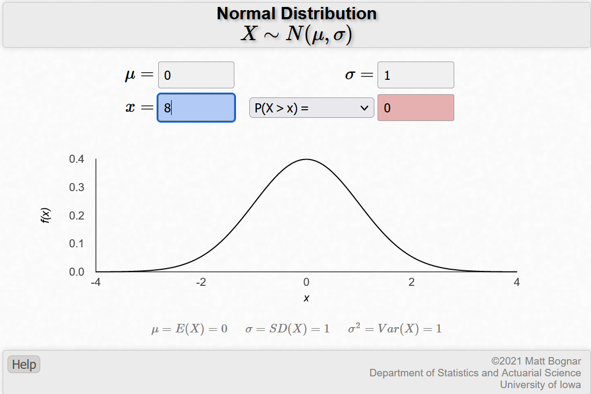
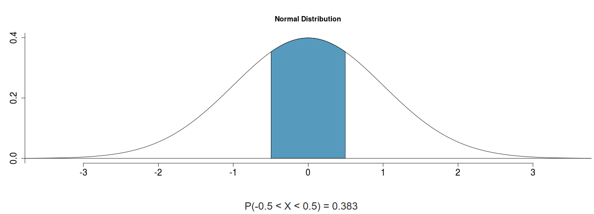
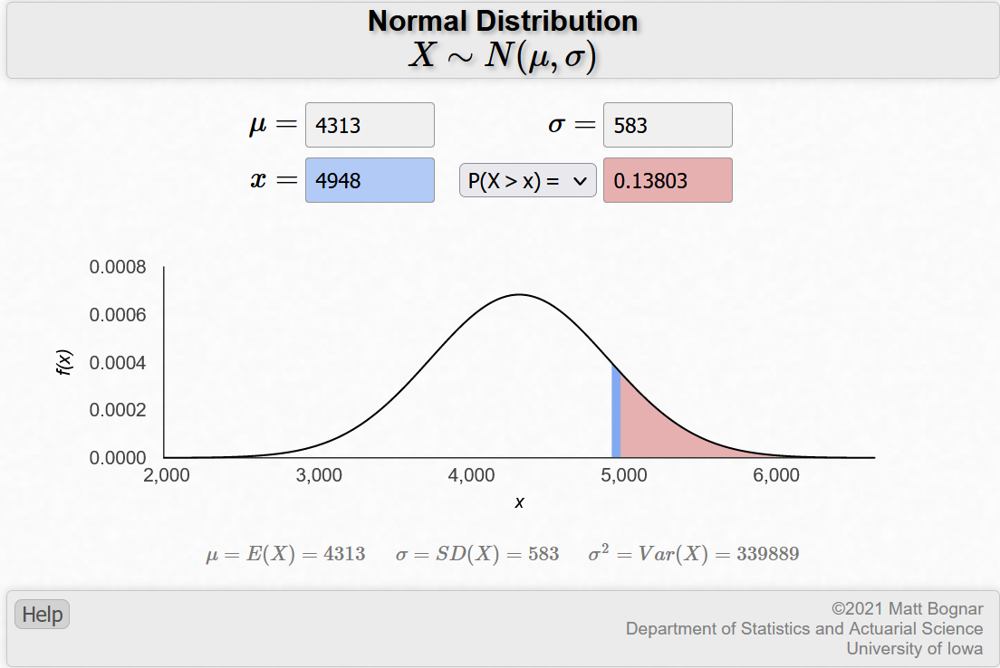
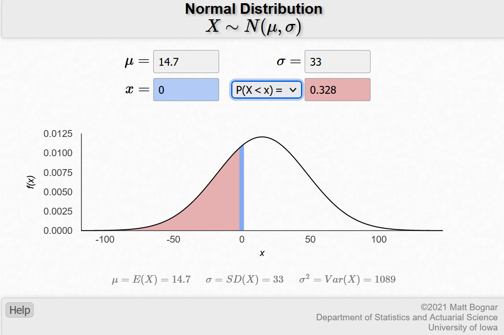
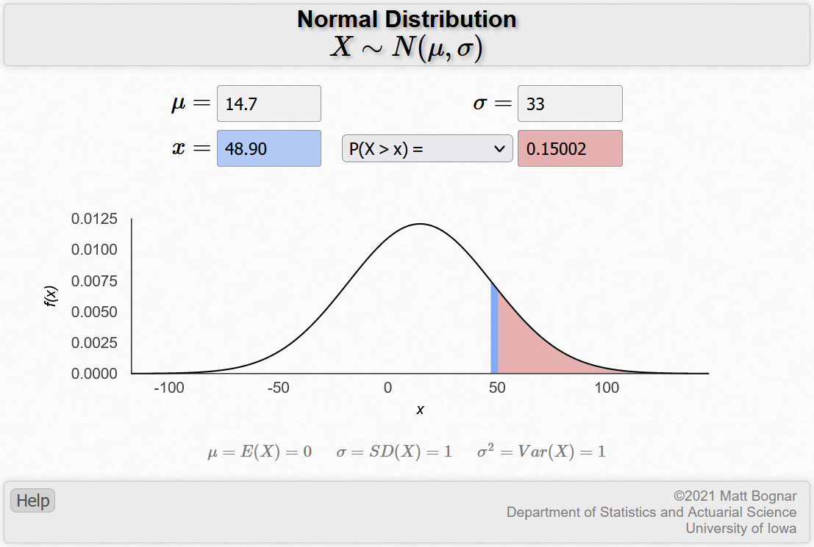

## The exercises from open intro are done first. The beginning of the lab exercise is denoted below as such.
## 4.2Area under the curve, Part II. What percent of a standard normal distribution N(mean = 0; sd = 1) is found in each region? Be sure to draw a graph.

## (a) Z > -1.13 
 {#id .class width=50% height=50%}
```{r}
library(scales)
a <- 1 - pnorm(-1.13,0,1)
percent(a, accuracy=0.01) #Answer
```


## (b) Z < 0.18
 {#id .class width=50% height=50%}
```{r}
b <- pnorm(0.18,0,1)
percent(b,accuracy=0.01) #Answer
```

## (c) Z > 8
 {#id .class width=50% height=50%}
```{r}
c <- 1 - pnorm(8,0,1)
percent(c, accuracy=0.01) #Answer
```
I used a different website as the one covered in class only went up to Z=4. https://homepage.divms.uiowa.edu/~mbognar/applets/normal.html

## (d) absolute(Z) < 0.5
 {#id .class width=50% height=50%}
```{r}
#Can also be rewritten to -0.5<=Z<=0.5
x <- pnorm(0.5,0,1) #percentile for z<0.5
y <- 1-x
z <- pnorm(-0.5,0,1) # percentile for abs calculation less than -0.5
q <- 1-y-z #1 minus each of the tail values gets the value in the middle, or 
#-0.5<Z<0.5
percent(q, accuracy=0.01) #Answer
```
## 4.4 Triathlon times, Part I: In triathlons, it is common for racers to be placed into age and gender groups. Friends Leo and Mary both completed the Hermosa Beach Triathlon, where Leo competed in the Men, Ages 30 - 34 group while Mary competed in the Women, Ages 25 - 29 group. Leo completed the race in 1:22:28 (4948 seconds), while Mary completed the race in 1:31:53 (5513 seconds). Obviously Leo finished faster, but they are curious about how they did within their respective groups. Can you help them? Here is some information on the performance of their groups:
## • The finishing times of the Men, Ages 30 - 34 group has a mean of 4313 seconds with a standard deviation of 583 seconds.
## • The finishing times of the Women, Ages 25 - 29 group has a mean of 5261 seconds with a standard deviation of 807 seconds.
## • The distributions of finishing times for both groups are approximately Normal.

## (a) Write down the short-hand for these two normal distributions.'
Men: N(µ=4313s,sd=583s)
Women: N(µ=5261s,sd=807s)

## (b) What are the Z-scores for Leo's and Mary's finishing times? What do these Z-scores tell you?
```{r}
(4948-4313)/583 #Leo Z-score
(5513-5261)/807 #Mary Z-score
##These scores tell me that Leo finished about 1.08 standard deviations above 
#the mean, and Mary finished about 0.31 standard deviations above the mean.
```
## (c) Did Leo or Mary rank better in their respective groups? Explain your reasoning.
Mary finished better in her respective group. As scores increase in standard deviation above the mean, this means the runner finished slower than the average runner in the respective group. Because Mary had a lower Z-Score, she finished closer to the mean than Leo did, and therefore had a better rank respective to her group.

## (d) What percent of the triathletes did Leo finish faster than in his group?
 {#id .class width=50% height=50%}
```{r}
d<-1-pnorm(4948,4313,583)
percent(d, accuracy=0.01)
```
## (e) What percent of the triathletes did Mary finish faster than in her group?
 {#id .class width=50% height=50%}
```{r}
e<-1 - pnorm(5513,5261,807)
percent(e, accuracy=0.01)
```
## (f) If the distributions of finishing times are not nearly normal, would your answers to parts (b) - (e) change? Explain your reasoning.
Yes, if the distributions of finishing times are not nearly normal, then the mean and standard deviation for the groups would have been impacted positively or negatively. Because of this, Mary and Leo may have finished closer to, or further away from the mean. In other words, their Z-scores may have indicated more or less standard deviations away from the mean. If this was the case, either of them could have finished better or worse relative to the percent of other triathletes, and therefore would have also ranked better or worse in their respective groups. 


## 4.8 CAPM: The Capital Asset Pricing Model (CAPM) is a financial model that assumes returns on a portfolio are normally distributed. Suppose a portfolio has an average annual return of 14.7% (i.e. an average gain of 14.7%) with a standard deviation of 33%. A return of 0% means the value of the portfolio doesn't change, a negative return means that the portfolio loses money, and a positive return means that the portfolio gains money.

## (a) What percent of years does this portfolio lose money, i.e. have a return less than 0%?
 {#id .class width=50% height=50%}
```{r}
percent(pnorm(0,14.7,33),accuracy=0.01)
```
## (b) What is the cutoff for the highest 15% of annual returns with this portfolio?

```{r}
f<-qnorm(.85)
(f*33)+14.7
##The cutoff is 48.90 percent growth
```
 {#id .class width=50% height=50%}

## This is the beginning of the lab.

```{r load-packages, message=FALSE}
library(tidyverse)
library(openintro)
head(fastfood)
```

### Exercise 1: Make a plot (or plots) to visualize the distributions of the amount of calories from fat of the options from these two restaurants. How do their centers, shapes, and spreads compare?

The center of the Dairy Queen plot below is relatively normal, with a center slightly below the mean at around 240 calories from fat. The overall distribution of the data, including the center, appears unimodal with one prominent peak. While the overall shape is relatively normal, it should be noted that the data is slightly skewed right based upon the overlay of the density of the normal curve. 

The center of the McDonalds plot below appears to be a bit less normal. The center, again is slightly below the mean around 270 calories from fat. The overall distribution of the data appears bimodal with two prominent peaks. The data is also noticeably skewed to the right based upon the overlay of the density of the normal curve.

Comparing the two plots, the spread appears larger relative to the individual dataset for Dairy Queen as opposed to McDonalds, as shown by the wider, lower appearance of the normal curve. However, the overall shape of the data for the Dairy Queen plot appears more normal, as is evident by the plot's unimodal shape and significantly less skew. Although both graphs are skewed right, the McDonalds plot is significantly more skewed based on appearance. The center of both graphs, based on density, appears to be less than the overall mean, thus illustrating the overall skewness of the data towards the right. In other words, the median is less than the mean.

```{r}
set.seed(1233)
mcdonalds <- fastfood %>%
  filter(restaurant == "Mcdonalds")
dairy_queen <- fastfood %>%
  filter(restaurant == "Dairy Queen")

dqmean <- mean(dairy_queen$cal_fat)
dqsd <- sd(dairy_queen$cal_fat)

ggplot(data = dairy_queen, aes(x = cal_fat)) +
  geom_blank() +
  geom_histogram(aes(y = ..density..)) +
  stat_function(fun = dnorm, args = c(mean = dqmean, sd = dqsd), col = "tomato")
```
```{r}
set.seed(1233)
mdmean <- mean(mcdonalds$cal_fat)
mdsd <- sd(mcdonalds$cal_fat)

ggplot(data = mcdonalds, aes(x = cal_fat)) +
  geom_blank() +
  geom_histogram(aes(y = ..density..)) +
  stat_function(fun = dnorm, args = c(mean = mdmean, sd = mdsd), col = "tomato")
```


### Exercise 2: Based on the this plot, does it appear that the data follow a nearly normal distribution?
As noted above, the data appears more normally distributed in the Dairy Queen plot than the McDonalds plot based on two primary factors. The first being that the McDonalds plot appears to be more right skewed than the Dairy Queen plot. The second is the median appears to be further away from the mean in the McDonalds plot, thus reinforcing the right skewness of the data.


### Exercise 3: Make a normal probability plot of sim_norm. Do all of the points fall on the line? How does this plot compare to the probability plot for the real data? (Since sim_norm is not a dataframe, it can be put directly into the sample argument and the data argument can be dropped.)

For the Dairy Queen dataset, the sim_norm plot appears to have almost, or all points fall on the line. This is expected, as this plot takes the Dairy Queen data and uses the rnorm() function to simulate a normal distribution. When comparing this plot to the real data, some variability can be seen near the tail end of the distribution. There is some definite non-normal behavior in the real data, as evidenced by the steep climb in the line shown on real data plot at the tail end. This supports our previous finding of slight right skewness, and would indicate to me a slightly right skewed dataset.

```{r}
set.seed(1233)
ggplot(data = dairy_queen, aes(sample = cal_fat)) +
  geom_line(stat = "qq")

sim_norm <- rnorm(n = nrow(dairy_queen), mean = dqmean, sd = dqsd)

ggplot() +
  geom_line(stat = "qq", aes(sample=sim_norm)) #normal probability plot of
#sim_norm
```


### Exercise 4: Does the normal probability plot for the calories from fat look similar to the plots created for the simulated data? That is, do the plots provide evidence that the calories from fat are nearly normal?

The normal probability plot for Dairy Queen calories from fat appears to be mostly similar to the simulated data, with the most difference showing in the upper tail end of the graphs. Where the actual data is similar to all simulated plots in the beginning and middle sections of the data, it only resembles the pattern of maybe one or two of the simulated datasets at the right tail end.

```{r}
set.seed(1233)
qqnormsim(sample = cal_fat, data = dairy_queen)
```


### Exercise 5: Using the same technique, determine whether or not the calories from McDonald’s menu appear to come from a normal distribution.

Based on the same technique for McDonalds, the calories from fat for the menu do not appear to be normally distributed. When comparing the normal probability plot for the real data set to the simulated normal dataset, some obvious differences are visually present. First, the trajectory of the line at the beginning and middle of the plot vary. In the real dataset, the line is much more shallow (i.e. stays much closer to the x axis), as opposed to the simulated normal dataset. When comparing normal probability plots from the real dataset to the simulated datasets using qqnormsim(), the behavior above is further validated. At the tail of the datasets, there is a large difference in visual appearance. The real dataset rises significantly steeply on the y-axis, whereas the simulated datasets appear to be much more linear in comparison to the rest of the data.

```{r}
set.seed(1233)
ggplot(data = mcdonalds, aes(sample = cal_fat)) +
  geom_line(stat = "qq") ##QQPlot for real data set

sim_normmd <- rnorm(n = nrow(mcdonalds), mean = mdmean, sd = mdsd)

ggplot() +
  geom_line(stat = "qq", aes(sample=sim_normmd)) #normal probability plot of
#sim_norm

qqnormsim(sample = cal_fat, data = mcdonalds) 
```


### Exercise 6: Write out two probability questions that you would like to answer about any of the restaurants in this dataset. Calculate those probabilities using both the theoretical normal distribution as well as the empirical distribution (four probabilities in all). Which one had a closer agreement between the two methods?

What is the probability that a randomly chosen Sonic product has more than 1200 mg of sodium?
Answer: The theoretical probability of a randomly chosen Sonic product containing more than 1200 mg of sodium is 58%, and 51% using the empirical probability.

What is the probability that a randomly chosen Burger King product has less than 10 g of sugar?
Answer: The theoretical probability of a randomly chosen Burger King product containing less than 10 g of sodium is 62%%, and 70% using the empirical probability.

Sonic has a very slightly closer agreement between the theoretical and empirical probability calculations for sodium as opposed to the same method applied to Burger King sugar content.

```{r}
Sonic <- fastfood %>%
  filter(restaurant == "Sonic")
BK <- fastfood %>%
  filter(restaurant == "Burger King")

#Sonic Calculations
sonicmean <- mean(Sonic$sodium)
sonicsd <- sd(Sonic$sodium)
1 - pnorm(1200, mean = sonicmean, sd = sonicsd) #Theoretical Probability 

Sonic %>%
  filter(sodium > 1200) %>%
  summarise(percent = n() / nrow(Sonic)) #Empirical Probability

#BK Calculations
BKmean <- mean(BK$sugar)
BKsd <- sd(BK$sugar)
pnorm(10, mean = BKmean, sd = BKsd) #Theoretical Probability 

BK %>%
  filter(sugar < 10) %>%
  summarise(percent = n() / nrow(BK)) #Empirical Probability
```


### Exercise 7: Now let’s consider some of the other variables in the dataset. Out of all the different restaurants, which ones’ distribution is the closest to normal for sodium?

After calculating the theoretical and empirical probabilities for sodium for all restaurants, Arbys and Taco Bell are both within 3%. Therefore, there is a tie between those two restaurants for closest to normal for sodium.

```{r}
#CF th= 47%, EM=37%, AB th=68%, EM=65%, Sub th=54%, EM=47%, Tbell th=35%, EM=32%,
#BKs th=52%, EM=46%, Sonic th=58%, EM=51%
CF <- fastfood %>%
  filter(restaurant == "Chick Fil-A")

AB <- fastfood %>%
  filter(restaurant == "Arbys")

Sub <- fastfood %>%
  filter(restaurant == "Subway")

TBell <- fastfood %>%
  filter(restaurant == "Taco Bell")

BKs <- fastfood %>%
  filter(restaurant == "Burger King")

CFmean <- mean(CF$sodium)
CFsd <- sd(CF$sodium)
1 - pnorm(1200, mean = CFmean, sd = CFsd) #Theoretical Probability 

CF %>%
  filter(sodium > 1200) %>%
  summarise(percent = n() / nrow(CF)) #Empirical Probability

ABmean <- mean(AB$sodium)
ABsd <- sd(AB$sodium)
1 - pnorm(1200, mean = ABmean, sd = ABsd) #Theoretical Probability 

AB %>%
  filter(sodium > 1200) %>%
  summarise(percent = n() / nrow(AB)) #Empirical Probability

Submean <- mean(Sub$sodium)
Subsd <- sd(Sub$sodium)
1 - pnorm(1200, mean = Submean, sd = Subsd) #Theoretical Probability 

Sub %>%
  filter(sodium > 1200) %>%
  summarise(percent = n() / nrow(Sub)) #Empirical Probability

TBellmean <- mean(TBell$sodium)
TBellsd <- sd(TBell$sodium)
1 - pnorm(1200, mean = TBellmean, sd = TBellsd) #Theoretical Probability 

TBell %>%
  filter(sodium > 1200) %>%
  summarise(percent = n() / nrow(TBell)) #Empirical Probability

BKsmean <- mean(BKs$sodium)
BKssd <- sd(BKs$sodium)
1 - pnorm(1200, mean = BKsmean, sd = BKssd) #Theoretical Probability 

BKs %>%
  filter(sodium > 1200) %>%
  summarise(percent = n() / nrow(BKs)) #Empirical Probability
```
## Excercise 8: Note that some of the normal probability plots for sodium distributions seem to have a stepwise pattern. why do you think this might be the case?

Stepwise patterns tend to occur more in numerical discrete datasets. Given that sodium is discrete due to being distinctly counted in what I'm assuming to be milligrams, this pattern proves valid within the normal probability plots.

## Exercise 9: As you can see, normal probability plots can be used both to assess normality and visualize skewness. Make a normal probability plot for the total carbohydrates from a restaurant of your choice. Based on this normal probability plot, is this variable left skewed, symmetric, or right skewed? Use a histogram to confirm your findings.

Based on the first two normal probability plots, I would expect the data to be fairly symmetric, with maybe a slight right skew. As confirmed within the histogram, the data is slightly skewed right.

```{r}
set.seed(1233)
ggplot(data = TBell, aes(sample = total_carb)) +
  geom_line(stat = "qq") ##QQ Plot of the real data to compare with simulated
#normal data below

TBellmeanc <- mean(TBell$total_carb)
TBellsdc <- sd(TBell$total_carb)

sim_normtb <- rnorm(n = nrow(TBell), mean = TBellmeanc, sd = TBellsdc)

ggplot() +
  geom_line(stat = "qq", aes(sample=sim_normtb)) #normal probability plot of
#sim_norm for Taco Bell total carbs

qqnormsim(sample = cal_fat, data = TBell) #Comparison of real Taco Bell data to
#simulated data

ggplot(data = TBell, aes(x = total_carb)) +
  geom_blank() +
  geom_histogram(aes(y = ..density..)) +
  stat_function(fun = dnorm, args = c(mean = TBellmeanc, sd = TBellsdc), col = "tomato")
```


