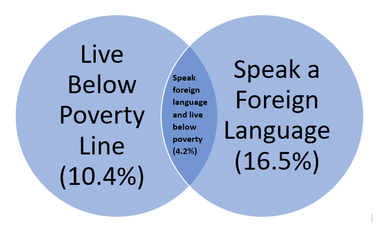
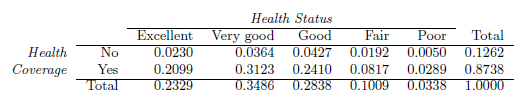
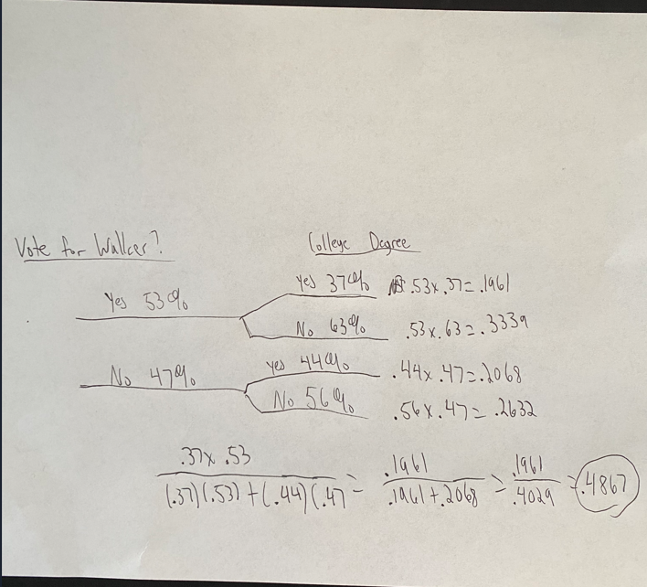

## 3.8 Poverty and language: The American Community Survey is an ongoing survey that provides data every year to give communities the current information they need to plan investments and services. The 2010 American Community Survey estimates that 14.6% of Americans live below the poverty line, 20.7% speak a language other than English (foreign language) at home, and 4.2% fall into both categories.

## (a) Are living below the poverty line and speaking a foreign language at home disjoint?
No, since it is possible for an American to speak a foreign language and live below the poverty line (4.2%), the two outcomes are not disjoint.

## (b) Draw a Venn diagram summarizing the variables and their associated probabilities.

 {#id .class width=50% height=50%}

## (c) What percent of Americans live below the poverty line and only speak English at home?
10.4%

## (d) What percent of Americans live below the poverty line or speak a foreign language at home?
10.4+16.5=26.9%

## (e) What percent of Americans live above the poverty line and only speak English at home?
1-.104-.165-.042=68.9%

## (f) Is the event that someone lives below the poverty line independent of the event that the person speaks a foreign language at home?
P(Below Poverty) x P(Foreign Language) = .104 X .165 = .018, which does not equal 
P(Below Poverty and Foreign Language) = .042, so the events are dependent.

## 3.12 School absences: Data collected at elementary schools in DeKalb County, GA suggest that each year roughly 25% of students miss exactly one day of school, 15% miss 2 days, and 28% miss 3 or more days due to sickness.

## (a) What is the probability that a student chosen at random doesn't miss any days of school due to sickness this year?
1-.25-.15-.28=32%

## (b) What is the probability that a student chosen at random misses no more than one day?
1-.15-.28=57%

## (c) What is the probability that a student chosen at random misses at least one day?
1-.32=68%

## (d) If a parent has two kids at a DeKalb County elementary school, what is the probability that neither kid will miss any school? Note any assumption you must make to answer this question.
.32*.32=10.24% This answer assumes the decision for neither child to miss any school due to sickness is independent of one another.

## (e) If a parent has two kids at a DeKalb County elementary school, what is the probability that both kids will miss some school, i.e. at least one day? Note any assumption you make.
.68*.68=46.24% This answer also assumes that the decision for either child to miss at least one day of school due to sickness is unrelated to one another. 

## (f) If you made an assumption in part (d) or (e), do you think it was reasonable? If you didn't make any assumptions, double check your earlier answers.
I don't think the assumption made in e is reasonable. If one child in a household is sick, I would argue there would be a higher chance of the other child getting sick. For d, the assumption made is probably more reasonable. If neither of the children get sick, then there isn't any reason to believe either of them missed school due to sickness.

## 3.16 Health coverage, relative frequencies. The Behavioral Risk Factor Surveillance System (BRFSS)is an annual telephone survey designed to identify risk factors in the adult population and report emerging health trends. The following table displays the distribution of health status of respondents to this survey (excellent, very good, good, fair, poor) and whether or not they have health insurance.

 {#id .class width=50% height=50%}

## (a) Are being in excellent health and having health coverage mutually exclusive?
No, .2099 of respondents fall into this combination.

## (b) What is the probability that a randomly chosen individual has excellent health?
.2329

## (c) What is the probability that a randomly chosen individual has excellent health given that he has health coverage?
.2099/.8738=.240

## (d) What is the probability that a randomly chosen individual has excellent health given that he doesn't have health coverage?
.0230/.1262=.182

## (e) Do having excellent health and having health coverage appear to be independent?
No, answers to c and d above would be the same if that were the case.

## 3.22 Exit poll. Edison Research gathered exit poll results from several sources for the Wisconsin recall election of Scott Walker. They found that 53% of the respondents voted in favor of Scott Walker. Addition- ally, they estimated that of those who did vote in favor for Scott Walker, 37% had a college degree, while 44% of those who voted against Scott Walker had a college degree. Suppose we randomly sampled a person who participated in the exit poll and found that he had a college degree. What is the probability that he voted in favor of Scott Walker?

SS Note - Professor Lowhorn, I apologize in advance for my chicken scratch handwriting! Let me know if you have questions while grading.

 {#id .class width=50% height=50%}

College Degree and Voted Yes: (.37 x .53)=.1961
College Degree and Voted No: (.44 x .47)=.2068

Bayes' Theorem: 

(.1961)/(.1961+.2068)=.4867
48.67% probability that a randomly sampled person who participated in the exit poll had a college degree and voted in favor or Scott Walker.

